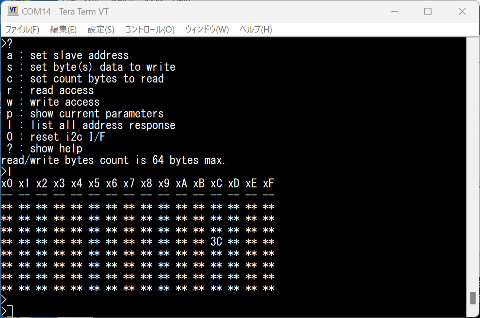

# Uno_i2c_term
I2C device access tool for Arduino Uno.

## usage:
- (1) Compile the files and upload to Arduino Uno (or compatible board).
- (2) Connect to any I2C device. Pull-up resistes on SCL,SDA will be needed.
- (3) Using terminal software, connect the virtual COM port of the Arduino, set speed as 115200bps.
- (4) Hit enter key and wait ">" prompt. "?" shows help menu.

## note.
As for I2C send(write) of Arduino Uno, default max data length is 32 bytes at once.

(screen example)

